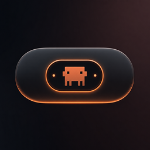

<div align="center">
  

  <h1>NotchAgent</h1>

  <p>A macOS menu bar app that brings Dynamic Island-style notifications to Claude Code CLI sessions.</p>

  <p>
    
    
    
  </p>
</div>

---

## Features

- **Notch UI** — animated overlay that expands from the MacBook notch
- **Live session monitoring** — track multiple Claude Code sessions in real time
- **Permission approvals** — approve or deny tool executions directly from the notch
- **Chat history** — view full conversation history with markdown rendering
- **Auto-setup** — hooks install automatically on first launch

## Requirements

- macOS 15.6+
- Claude Code CLI

## Install

Download the latest release or build from source:

```bash
xcodebuild -scheme ClaudeIsland -configuration Release build
```

## Usage

### The pill

NotchAgent lives as a small pill overlaid on your MacBook's notch (or floating near the menu bar on notchless Macs). It stays hidden until a Claude Code session needs your attention:

| Indicator | Meaning |
| --- | --- |
| Spinner + elapsed time | A session is actively working |
| Orange dot | A session is waiting on a tool permission |
| Green checkmark | A session finished and is waiting for your next message |

Click or hover the pill to expand it.

### Sessions & chat

Expanded, the notch lists every running Claude Code session. Click one to open its chat — full conversation history with markdown rendering, live tool-call status, and a composer to type a message directly from the notch. Messages are delivered straight to the session's terminal (via tmux, terminal scripting, or synthetic keystrokes as a last resort), so you don't have to switch windows to keep a conversation going.

### Approvals

When Claude asks to run a tool, the notch expands with Approve/Deny buttons right there — no alt-tabbing to the terminal.

### The crab icon

Click it to bring the relevant terminal (or Claude Desktop, if installed) to the front — useful when you want to look at the full session outside the notch.

### Settings

Open the menu (☰ in the top-right of the expanded notch) for:

| Setting | What it does |
| --- | --- |
| Theme | Light, dark, or match system |
| Screen | Which display shows the notch on multi-monitor setups |
| Sound | The notification sound played when a session finishes |
| Claude Directory | Which `~/.claude` projects directory to watch |
| Launch at Login | Start NotchAgent automatically when you log in |
| Hooks | Install/uninstall the Claude Code hooks NotchAgent relies on |
| Accessibility | Required so NotchAgent can type messages into a terminal or Claude Desktop on your behalf |

## How It Works

NotchAgent installs hooks into `~/.claude/hooks/` that communicate session state via a Unix socket. The app listens for events and displays them in the notch overlay.

When Claude needs permission to run a tool, the notch expands with approve/deny buttons — no need to switch to the terminal.

## Analytics

NotchAgent uses Mixpanel to collect anonymous usage data:

- **App Launched** — app version, build number, macOS version
- **Session Started** — when a new Claude Code session is detected

No personal data or conversation content is collected.

## License

Apache 2.0
